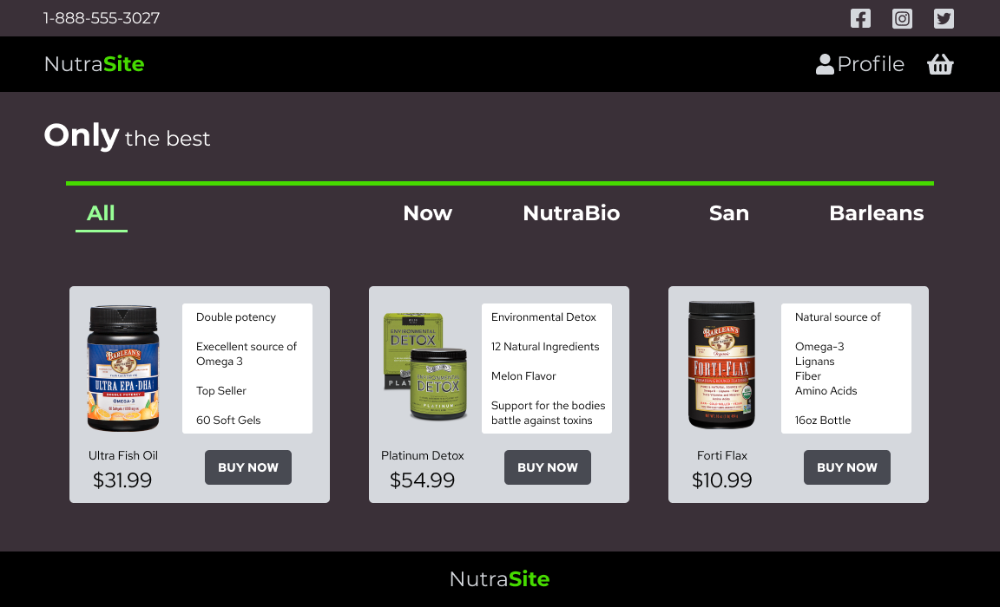

# ecom_mern

NutraSite has been a pet project for some time. It has gone through many upgrades and many versions. I always seem to find something wrong and change things. I have lost so much of the work I have done on this concept. 

This version is built in MERN stack. React in the front, Mongo in the back. This set up is perfect for small business of say under a hundred employees, a few hundred products. 

It features a products review section, shopping cart, log in, register, admin rights, dashboard to add, edit, or delete products, review and ship orders and more.

This site is currently under construction.
